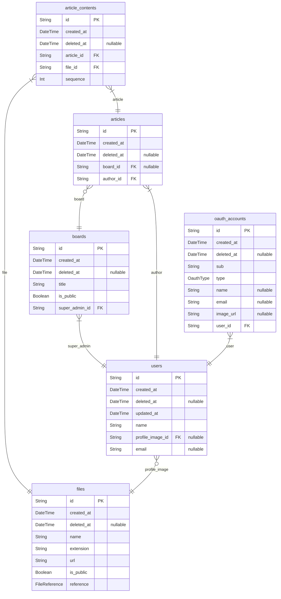
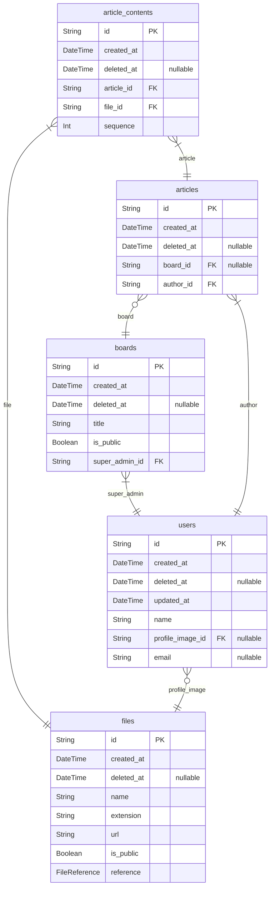
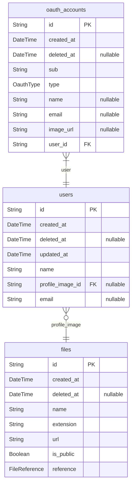
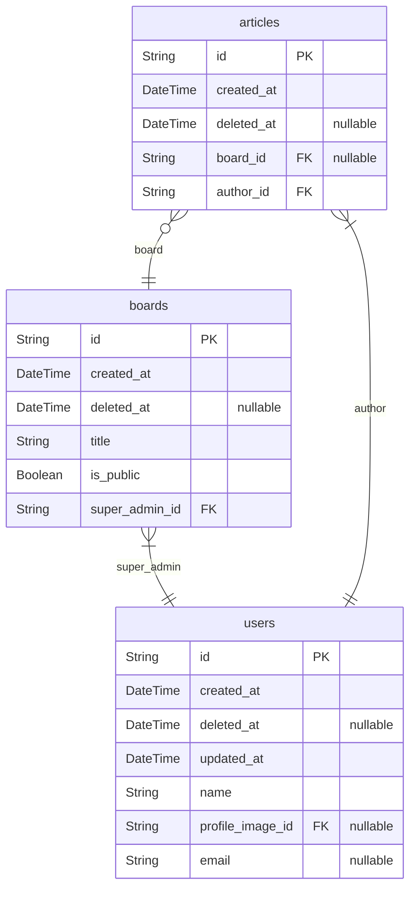

# template

> Generated by [`prisma-markdown`](https://github.com/samchon/prisma-markdown)

-   [All](#All)
-   [Article](#Article)
-   [User](#User)
-   [Board](#Board)

## All

### `files`

external file entity

a entity can update only deleted_at

**Properties**

-   `id`: entity identity
-   `created_at`: created time
-   `deleted_at`
    > deleted time
    >
    > if null, a row is deleted data
-   `name`: filename
-   `extension`
    > file extension
    >
    > e.g) html, md, txt, jpg...
-   `url`: url of real file
-   `is_public`: if true, a file is public
-   `reference`: reference of file

### `boards`

board root entity

**Properties**

-   `id`: entity identity
-   `created_at`: created time
-   `deleted_at`
    > deleted time
    >
    > if null, a row is deleted data
-   `title`: title of board
-   `is_public`: if true, board is public
-   `super_admin_id`
    > referenced in user root entity
    > this admin is super administrator
    > super administrator is only one

### `articles`

article root entity

a entity can update only deleted_at

**Properties**

-   `id`: entity identity
-   `created_at`: created time
-   `deleted_at`
    > deleted time
    >
    > if null, a row is deleted data
-   `board_id`
    > referenced in board entity
    > if null, a article is personal article
-   `author_id`
    > referenced in user entity
    > author id referenced in user root entity

### `article_contents`

article content entity

**Properties**

-   `id`: entity identity
-   `created_at`: created time
-   `deleted_at`
    > deleted time
    >
    > if null, a row is deleted data
-   `article_id`: referenced in article root entity
-   `file_id`: referenced in file entity
-   `sequence`: sequence of content

### `users`

user root entity

**Properties**

-   `id`: entity identity
-   `created_at`: created time
-   `deleted_at`
    > deleted time
    >
    > if null, a row is deleted data
-   `updated_at`: updated time
-   `name`: displayed username in service
-   `profile_image_id`: referenced in file entity
-   `email`: verified email address

### `oauth_accounts`

oauth authentication entity

generated when a user signs up through an OAuth service.

**Properties**

-   `id`: entity identity
-   `created_at`: created time
-   `deleted_at`
    > deleted time
    >
    > if null, a row is deleted data
-   `sub`: user identity referenced in oauth service
-   `type`: oauth service type
-   `name`: username in oauth service
-   `email`: verified email in oauth service
-   `image_url`: profile image url in oauth service
-   `user_id`: referenced in user root entity

## Article

### `files`

external file entity

a entity can update only deleted_at

**Properties**

-   `id`: entity identity
-   `created_at`: created time
-   `deleted_at`
    > deleted time
    >
    > if null, a row is deleted data
-   `name`: filename
-   `extension`
    > file extension
    >
    > e.g) html, md, txt, jpg...
-   `url`: url of real file
-   `is_public`: if true, a file is public
-   `reference`: reference of file

### `boards`

board root entity

**Properties**

-   `id`: entity identity
-   `created_at`: created time
-   `deleted_at`
    > deleted time
    >
    > if null, a row is deleted data
-   `title`: title of board
-   `is_public`: if true, board is public
-   `super_admin_id`
    > referenced in user root entity
    > this admin is super administrator
    > super administrator is only one

### `articles`

article root entity

a entity can update only deleted_at

**Properties**

-   `id`: entity identity
-   `created_at`: created time
-   `deleted_at`
    > deleted time
    >
    > if null, a row is deleted data
-   `board_id`
    > referenced in board entity
    > if null, a article is personal article
-   `author_id`
    > referenced in user entity
    > author id referenced in user root entity

### `article_contents`

article content entity

**Properties**

-   `id`: entity identity
-   `created_at`: created time
-   `deleted_at`
    > deleted time
    >
    > if null, a row is deleted data
-   `article_id`: referenced in article root entity
-   `file_id`: referenced in file entity
-   `sequence`: sequence of content

### `users`

user root entity

**Properties**

-   `id`: entity identity
-   `created_at`: created time
-   `deleted_at`
    > deleted time
    >
    > if null, a row is deleted data
-   `updated_at`: updated time
-   `name`: displayed username in service
-   `profile_image_id`: referenced in file entity
-   `email`: verified email address

## User

### `files`

external file entity

a entity can update only deleted_at

**Properties**

-   `id`: entity identity
-   `created_at`: created time
-   `deleted_at`
    > deleted time
    >
    > if null, a row is deleted data
-   `name`: filename
-   `extension`
    > file extension
    >
    > e.g) html, md, txt, jpg...
-   `url`: url of real file
-   `is_public`: if true, a file is public
-   `reference`: reference of file

### `users`

user root entity

**Properties**

-   `id`: entity identity
-   `created_at`: created time
-   `deleted_at`
    > deleted time
    >
    > if null, a row is deleted data
-   `updated_at`: updated time
-   `name`: displayed username in service
-   `profile_image_id`: referenced in file entity
-   `email`: verified email address

### `oauth_accounts`

oauth authentication entity

generated when a user signs up through an OAuth service.

**Properties**

-   `id`: entity identity
-   `created_at`: created time
-   `deleted_at`
    > deleted time
    >
    > if null, a row is deleted data
-   `sub`: user identity referenced in oauth service
-   `type`: oauth service type
-   `name`: username in oauth service
-   `email`: verified email in oauth service
-   `image_url`: profile image url in oauth service
-   `user_id`: referenced in user root entity

## Board

### `boards`

board root entity

**Properties**

-   `id`: entity identity
-   `created_at`: created time
-   `deleted_at`
    > deleted time
    >
    > if null, a row is deleted data
-   `title`: title of board
-   `is_public`: if true, board is public
-   `super_admin_id`
    > referenced in user root entity
    > this admin is super administrator
    > super administrator is only one

### `articles`

article root entity

a entity can update only deleted_at

**Properties**

-   `id`: entity identity
-   `created_at`: created time
-   `deleted_at`
    > deleted time
    >
    > if null, a row is deleted data
-   `board_id`
    > referenced in board entity
    > if null, a article is personal article
-   `author_id`
    > referenced in user entity
    > author id referenced in user root entity

### `users`

user root entity

**Properties**

-   `id`: entity identity
-   `created_at`: created time
-   `deleted_at`
    > deleted time
    >
    > if null, a row is deleted data
-   `updated_at`: updated time
-   `name`: displayed username in service
-   `profile_image_id`: referenced in file entity
-   `email`: verified email address
