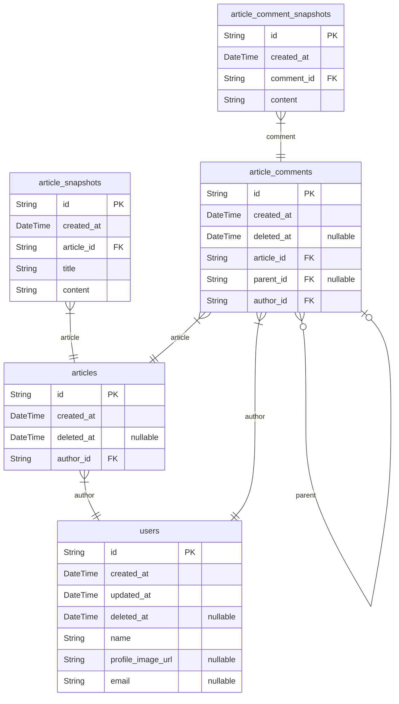
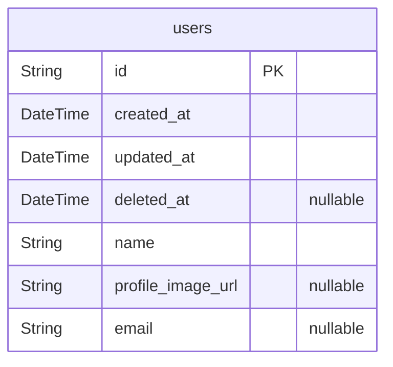
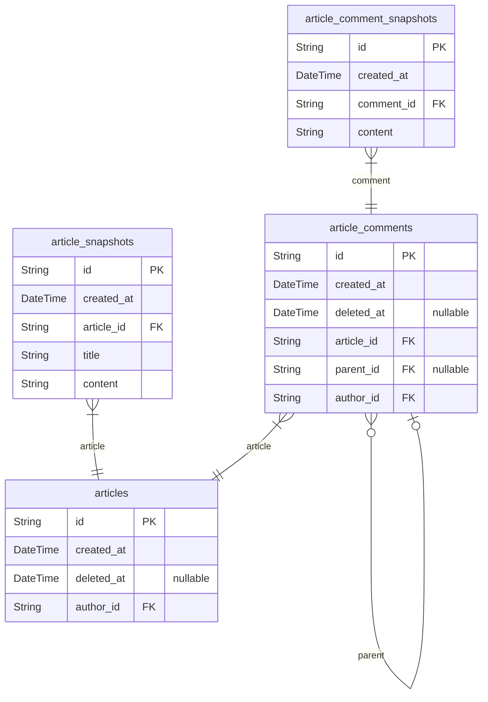

# BBS

> Generated by [`prisma-markdown`](https://github.com/samchon/prisma-markdown)

-   [All](#All)
-   [User](#User)
-   [BBS](#BBS)

## All

### `users`

User Root Entity

**Properties**

-   `id`: entity uuid identity
-   `created_at`: creation time of record
-   `updated_at`: revision time of record
-   `deleted_at`
    > deletion time of record
    >
    > if null, a row is soft-deleted data
-   `name`: deplayed username in service
-   `profile_image_url`: url path for profile image
-   `email`: verified email address

### `articles`

Article Root Entity

**Properties**

-   `id`: entity uuid identity
-   `created_at`: creation time of record
-   `deleted_at`
    > deletion time of record
    >
    > if null, a row is soft-deleted data
-   `author_id`: referenced in user root entity

### `article_snapshots`

Snapshot of Article

a `article_snapshot` contains all content of the article.
if article update body or title, a new article_snapshot is created.

**Properties**

-   `id`: entity uuid identity
-   `created_at`: creation time of record
-   `article_id`: referenced in article root entity
-   `title`: title of article
-   `content`
    > content of article
    > content is only text with 20,000 limit

### `article_comments`

Article Comment Root Entity

**Properties**

-   `id`: entity uuid identity
-   `created_at`: creation time of record
-   `deleted_at`
    > deletion time of record
    >
    > if null, a row is soft-deleted data
-   `article_id`: referenced in article root entity
-   `parent_id`
    > referenced in article comment root entity
    > if not null, a comment is reply of parent comment
-   `author_id`: referenced in user root entity

### `article_comment_snapshots`

Snapshot of Article Comment

a `article_comment_snapshot` contains all content of the comment.
if comment update body or title, a new article_comment_snapshot is created.

**Properties**

-   `id`: entity uuid identity
-   `created_at`: creation time of record
-   `comment_id`: referenced in article comment root entity
-   `content`
    > content of comment
    > content is only text with 1,000 limit

## User

### `users`

User Root Entity

**Properties**

-   `id`: entity uuid identity
-   `created_at`: creation time of record
-   `updated_at`: revision time of record
-   `deleted_at`
    > deletion time of record
    >
    > if null, a row is soft-deleted data
-   `name`: deplayed username in service
-   `profile_image_url`: url path for profile image
-   `email`: verified email address

## BBS

### `articles`

Article Root Entity

**Properties**

-   `id`: entity uuid identity
-   `created_at`: creation time of record
-   `deleted_at`
    > deletion time of record
    >
    > if null, a row is soft-deleted data
-   `author_id`: referenced in user root entity

### `article_snapshots`

Snapshot of Article

a `article_snapshot` contains all content of the article.
if article update body or title, a new article_snapshot is created.

**Properties**

-   `id`: entity uuid identity
-   `created_at`: creation time of record
-   `article_id`: referenced in article root entity
-   `title`: title of article
-   `content`
    > content of article
    > content is only text with 20,000 limit

### `article_comments`

Article Comment Root Entity

**Properties**

-   `id`: entity uuid identity
-   `created_at`: creation time of record
-   `deleted_at`
    > deletion time of record
    >
    > if null, a row is soft-deleted data
-   `article_id`: referenced in article root entity
-   `parent_id`
    > referenced in article comment root entity
    > if not null, a comment is reply of parent comment
-   `author_id`: referenced in user root entity

### `article_comment_snapshots`

Snapshot of Article Comment

a `article_comment_snapshot` contains all content of the comment.
if comment update body or title, a new article_comment_snapshot is created.

**Properties**

-   `id`: entity uuid identity
-   `created_at`: creation time of record
-   `comment_id`: referenced in article comment root entity
-   `content`
    > content of comment
    > content is only text with 1,000 limit
