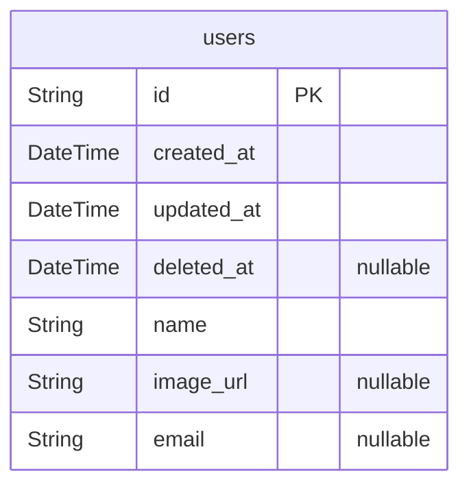

# template

> Generated by [`prisma-markdown`](https://github.com/samchon/prisma-markdown)

-   [Users](#Users)

## Users

### `users`

사용자 기본정보

서비스에 가입시 생성되는 사용자 기본 정보

**Properties**

-   `id`:
-   `created_at`: 데이터 생성일자
-   `updated_at`: 최근 수정일자
-   `deleted_at`
    > 데이터 삭제일자
    >
    > 데이터가 null이 아닌 경우, 삭제된 데이터를 의미한다.
-   `name`: 서비스에 표시되는 사용자명
-   `image_url`: 사용자 프로필 이미지 url
-   `email`: 인증된 이메일 주소
