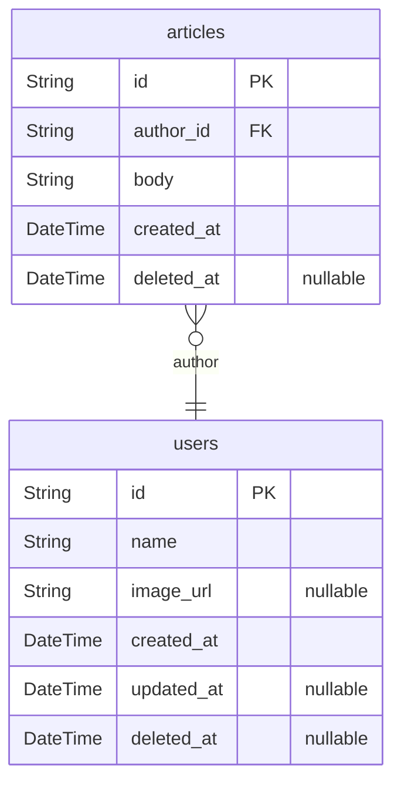
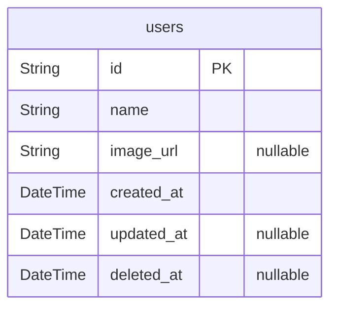

# Template

> Generated by [`prisma-markdown`](https://github.com/samchon/prisma-markdown)

-   [All](#All)
-   [User](#User)

## All

### `users`

Root Entity of User

**Properties**

-   `id`: `uuid` string
-   `name`: displayed name of user
-   `image_url`: url of user profile image
-   `created_at`: creation time of record
-   `updated_at`: revision time of record
-   `deleted_at`: deletion time of record

### `articles`

Root Entity of Article

**Properties**

-   `id`: `uuid` string
-   `author_id`
    > referenced in `users`
    >
    > `uuid` string
-   `body`:
-   `created_at`: creation time of record
-   `deleted_at`: deletion time of record

## User

### `users`

Root Entity of User

**Properties**

-   `id`: `uuid` string
-   `name`: displayed name of user
-   `image_url`: url of user profile image
-   `created_at`: creation time of record
-   `updated_at`: revision time of record
-   `deleted_at`: deletion time of record
